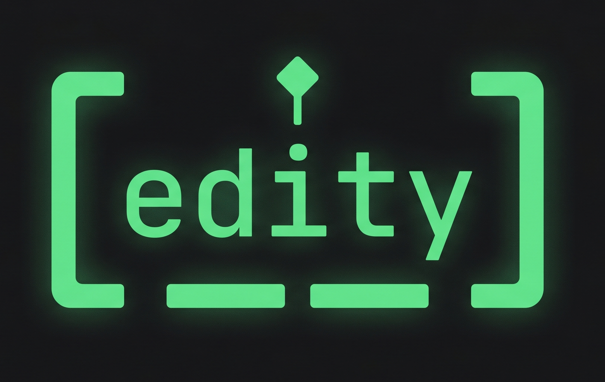
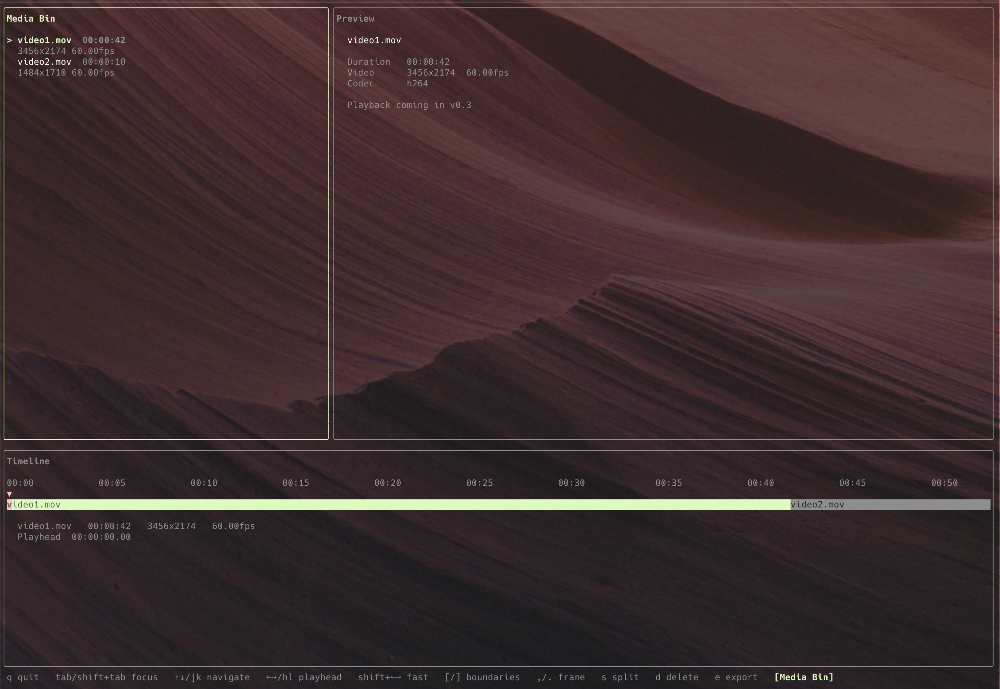

<p align="center">
  
</p>

# edity

A terminal video editor for developers. Cut, stitch, and export clips without leaving your keyboard.

```
edity clip1.mp4 clip2.mp4 clip3.mp4
```


<p align="center">
  
</p>

## Why

Recording gameplay, simulations, or dev demos is easy. Editing them shouldn't require learning Video Editing tools for us devs. `edity` opens a TUI directly in your terminal — a timeline, a media bin, and a preview — all keyboard-driven, no mouse required.

## Prerequisites

FFmpeg must be installed and available on your `$PATH`.

```bash
# macOS
brew install ffmpeg

# Ubuntu / Debian
apt install ffmpeg

# Windows (winget)
winget install ffmpeg
```

## Install

> Binaries and a Homebrew tap are coming in a later release. For now, build from source.

```bash
git clone https://github.com/panoramix360/edity.git
cd edity
go build -o edity .
```

## Usage

```bash
edity video1.mp4 video2.mp4 video3.mp4
```

The editor opens with your clips pre-loaded on the timeline in the order you passed them.

### Keybindings

| Key | Action |
|-----|--------|
| `←` `→` | Move playhead (1 second) |
| `,` `.` | Step playhead one frame backward / forward |
| `[` `]` | Jump to previous / next clip boundary |
| `Tab` / `Shift+Tab` | Cycle active pane |
| `S` | Split clip at playhead |
| `D` / `Backspace` | Delete selected clip |
| `E` | Export final video |
| `Q` / `Ctrl+C` | Quit |

## Roadmap

- **v0.1** — foundation: 3-pane TUI layout, clip metadata, timeline rendering ✓
- **v0.2** — editing: split, delete, timeline playhead, frame stepping ✓
- **v0.3** — export: FFmpeg filter_complex render with progress bar ✓
- **v0.4** — playback: ffplay integration, inline frame preview exploration
- **v0.5** — distribution: cross-platform binaries, Homebrew tap

## Contributing

This project is in early development. Issues and PRs are welcome — just open an issue first so we can discuss before you invest time building something.

## License

MIT
